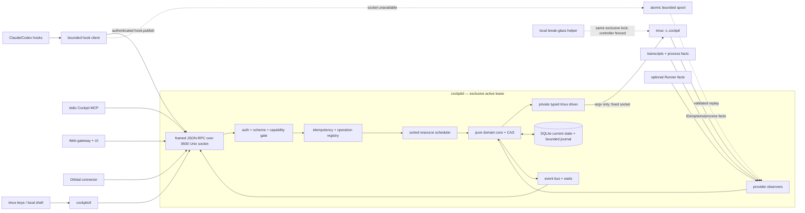
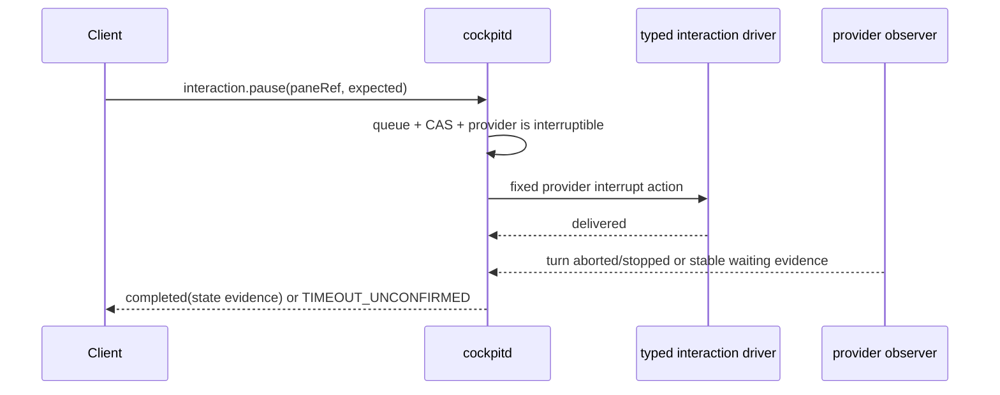
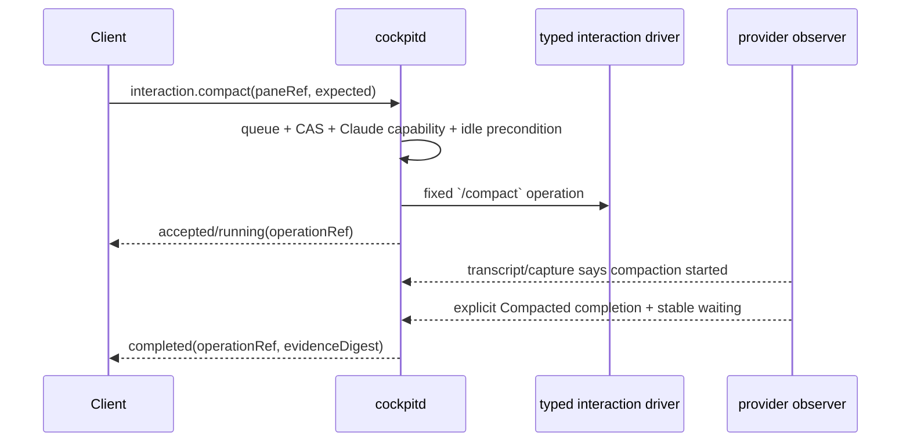

# Architecture, identity and command sequences

## Context and component diagram



The Unix socket is not a remote boundary. The web gateway terminates HTTP/Access and holds a restricted client credential; external clients never see the socket or tmux server.

## Domain model

| Entity/value | Authority and meaning |
|---|---|
| `ControllerEpoch` | new opaque value on every successful controller boot; lets clients detect event-stream discontinuity |
| `WorkspaceRef` | opaque Cockpit logical workspace identity; not a tmux window id or name |
| `PaneRef` | opaque Cockpit logical pane/slot identity; the only mutation target identity |
| `AgentSessionRef` | provider-qualified adopted conversation identity, for example `{provider:'claude', id:<uuid>}`; enrichment/binding, never pane identity |
| `TmuxLocator` | current `{serverFingerprint, windowId, paneId, displayTarget}`; volatile and diagnostic |
| `Generation` | per-resource material-incarnation counter; changes when the logical binding or reconstructive identity changes |
| `ResourceVersion` | per-resource monotonic CAS counter; changes on every material domain update, including move/metadata/lifecycle/source binding |
| `ObservedExecutionState` | provider-derived `starting | working | waiting | paused | stopped | failed | unknown`; facts retain source/confidence/freshness |
| `AttentionState` | Cockpit projection `none | just-finished | needs-input | waiting-gate | degraded`; not asserted by clients |
| `DisplayMetadata` | declared label/badge, separately versioned and sanitized |
| `SourceHealth` | per source `healthy | stale | unavailable | invalid`, observed time and diagnostic code |
| `Operation` | durable bounded lifecycle `accepted | queued | running | completed | failed | cancelled | recovery-required` |
| `Capability` | named protocol permission intersected across server support, client profile, target/provider support and current state |

### Identity lifecycle

Refs are random UUIDv7 values with typed textual prefixes (`cpw_`, `cpp_`, `cpo_`) for diagnostics. Randomness prevents callers from deriving another target; authorization never relies on opacity alone.

| Event | `paneRef` | generation | resource version | tmux locator | agent session binding |
|---|---|---:|---:|---|---|
| tmux pane index changes because sibling is removed | unchanged | unchanged | increments because its projected locator/topology changed | display target/index changes; tmux `%pane_id` normally unchanged | unchanged |
| pane moves to another workspace | unchanged | unchanged | increments | window/display target changes | unchanged |
| process respawn for recover, same intended conversation | unchanged | increments | increments | pane id normally unchanged; process fingerprint changes | same expected `AgentSessionRef`, then observer confirms |
| provider starts a new conversation (`/clear`/hook reports new ID) | unchanged | increments | increments | unchanged | replace binding; old binding retained in bounded history |
| retarget pane to a different existing conversation/provider | unchanged (same logical slot) | increments | increments | normally unchanged | replaced deliberately |
| soft remove during grace | unchanged | unchanged | increments | locator moves to controller graveyard workspace | unchanged; lifecycle `soft-removed` |
| undo soft remove | unchanged | unchanged | increments | new workspace locator | unchanged |
| grace expires/hard kill | tombstoned, never reusable | increments on tombstone record | increments | absent | last binding retained only in tombstone/operation evidence |
| new pane appears at the same display position | **new `paneRef`** | starts at 1 | starts at 1 | may reuse index and even a later `%id` | independently adopted |
| controller restarts, tmux survived and stamps match | unchanged | unchanged | unchanged except source freshness/reconcile projection | remapped from live tmux | unchanged if evidence agrees |
| full tmux server rebuild from a controller snapshot | restored logical refs for explicitly restored panes | increments | increments | entirely new tmux IDs/server fingerprint | resume/adopt expected session; mismatch is visible conflict |
| unowned live pane discovered | new quarantined `paneRef` only after deterministic adoption policy or operator action | starts at 1 | starts at 1 | observed locator | binding derived only with provider evidence |

The full-server rebuild rule deliberately distinguishes **logical restore** from **delete/recreate**. Only a controller-owned snapshot naming a pane ref may restore that ref. An ad hoc pane at a familiar position never inherits it.

### Identity stamps and locators

The controller projects `@cockpit_pane_ref`, `@cockpit_pane_generation`, `@cockpit_workspace_ref`, and `@cockpit_last_op` into tmux as recovery aids. SQLite remains the durable logical registry; tmux options are untrusted observations because a same-user process can alter them. A binding is accepted only when stamp shape, store record, server fingerprint, topology and effect evidence are coherent.

The tmux server fingerprint is a controller UUID projected at server/session scope and stored durably. A missing/different fingerprint is a server rebuild or external replacement, never a reason to attach old refs by display index.

## Atomic compare-and-set and scheduling

Every mutating request contains:

```text
typed non-empty expectations for every affected pane/workspace/session/projection
exact stable ref, generation and resourceVersion per pane/workspace
expected material state/member digest/session uniqueness (allowlisted fields only)
caller/client identity + capability profile
JSON-RPC envelope id + time-bearing idempotencyKey + canonical intent digest
deadline
typed payload
```

Processing is deliberately two-stage:

1. **Admission transaction:** authenticate, schema/domain validate, capability-check, bind idempotency key to canonical intent, create `accepted` operation, and enqueue its immutable lock set. An obviously stale request may fail early, but early success is not the CAS.
2. **Execution step:** when the operation reaches every required queue head, refresh the target’s live tmux mapping, use one short SQLite write transaction to compare generation/version/material expectations and commit `effect-intent`, then close that transaction before issuing the typed tmux effect. The in-memory resource locks remain held, so no overlapping controller mutation can interleave while SQLite is not locked across the subprocess. Inspect effect evidence and use a second short transaction to commit the new projection/result.

If CAS fails at stage 2, no tmux command is issued. The error returns actual safe-to-disclose generation/version/material fields and a fresh snapshot hint. Coverage is exact: move requires pane/source/destination expectations; spawn requires destination; resume requires destination plus session uniqueness; retarget requires pane plus new-session uniqueness; workspace close/undo requires workspace version and member digest; maintenance and break-glass require projection epoch/version. A missing or extraneous expectation is rejected before admission.

### Lock keys and deadlock rule

- pane-only interaction: `pane:<paneRef>`;
- move: `pane:<ref>`, `workspace:<source>`, `workspace:<destination>`;
- spawn into existing workspace: `workspace:<ref>` plus `session:<provider:id>` when resuming;
- retarget/recover: `pane:<ref>` plus old/new `session:<provider:id>` guards;
- workspace close/restore: workspace plus the sorted current member pane keys;
- full reconcile/snapshot/server rebuild/break-glass preparation: `global:*` barrier.

The scheduler computes the complete key set from one topology snapshot, sorts keys bytewise and acquires them only in that order. It never waits while holding a partial set: if all heads are not available, it releases admission claims and retries. After acquisition it revalidates membership/CAS. Changed dynamic membership releases **all** claims and returns `QUEUE_CONFLICT`; any re-admission is a fresh scheduling attempt against the same immutable client intent and can succeed only when its exact expectations still cover the lock set. It never recomputes membership while holding any claim. `global:*` is mutually exclusive with every mutation but not with bounded reads from the last committed snapshot.

Observer facts that would update a resource currently held by a mutation are sequenced through that same resource queue (or buffered and committed immediately after it). Thus an observer version increment cannot interleave between the execution CAS and its effect probe. Facts for unrelated resources continue independently.

Two different requests with the same expected version can both be admitted. At execution, the first successful effect increments the version; the second then receives `CONFLICT_VERSION`. This is the required exactly-one-wins behavior unless an operation explicitly declares commutativity. V1 declares no mutating operations commutative.

### Exact pane-index race sentinel

1. Create workspace `W` with pane A at display `:2.0` and intended pane B at `:2.1`; record B’s exact `paneRef/generation/resourceVersion`, process fingerprint, options and scrollback sentinel.
2. Through client 1, remove A. tmux reindexes B to `:2.0`; the locator observer commits that material topology change and increments B’s resource version.
3. Through client 2, submit the already-built mutation for B using B’s **old** tuple.
4. Execution-time CAS must return `CONFLICT_VERSION`, issue zero mutation argv, and leave B—and every other pane—byte-for-byte/process/options unchanged. Safe mutation is not an allowed outcome for this required stale-request sentinel.
5. Separately test locator poisoning at the client boundary: corrupt the client’s cached `PaneView.locator.displayTarget` so it names another pane, then build a fresh mutation for B from B’s current stable tuple. The serialized V1 request must contain no locator or display target at all; with no concurrent change it must mutate exactly B by `paneRef`, and the pane named by the poisoned cache must remain untouched.
6. Separately delete/tombstone B and create C at B’s old display position. B’s old request must fail `TARGET_GONE`/`CONFLICT_GENERATION`, and C must remain unchanged.

The test fails if it merely observes a nonzero status: it asserts the sentinel text/process/options of every non-target pane are unchanged and inspects the controller driver trace to prove no mutation argv named C’s tmux ID.

## State projection rules

Observers publish facts, not final state. The pure projector applies a precedence table and retains disagreements:

1. verified provider hook with matching pane/session and fresh timestamp;
2. transcript turn boundary with matching provider/session;
3. process/tmux liveness facts;
4. provider-specific fallback; unknown remains unknown.

`just-finished` is a Cockpit attention latch on a fresh `working -> waiting` transition and clears only on explicit acknowledgement/focus policy or renewed work. `needs-input` requires provider evidence; Codex’s absent approval signal stays absent. Runner `waiting-gate` is a separate source/correlation and attention projection, not an override that rewrites provider execution state. Stale/disagreeing inputs produce `sourceHealth=stale|invalid` and may produce `attention=degraded`; clients see both the selected projection and bounded competing-source diagnostics.

## Principal command sequences

### Spawn or resume a pane

```mermaid
sequenceDiagram
  participant C as Client
  participant D as cockpitd
  participant S as Scheduler/SQLite
  participant T as private tmux driver
  participant O as Observers

  C->>D: pane.spawn(workspaceRef, expected, idempotencyKey, payload)
  D->>S: auth + intent digest + accepted operation
  S-->>C: accepted(operationRef)
  D->>S: acquire workspace/session keys; recheck CAS
  D->>S: commit effect-intent(opRef, paneRef, probe)
  D->>T: typed create/reuse + identity/op stamps + fixed launch
  T-->>D: volatile pane/window IDs
  D->>O: immediate topology/process inspect
  O-->>D: pane stamp/process evidence
  D->>S: commit pane projection, versions, completed effect
  D-->>C: operation.completed(paneRef, generation, version, locator)
  O-->>D: later adopted AgentSessionRef / state fact
  D-->>C: event pane.changed(session binding/source state)
```

For a brand-new agent, completion means “one correctly stamped process-bearing pane exists,” not “the provider created a transcript.” Adoption is a later event. For resume-existing, the session guard proves the same provider session is not already live elsewhere before launch and again at effect time.

### Nudge and resume/continue

```mermaid
sequenceDiagram
  participant C as Client/MCP
  participant D as cockpitd
  participant Q as pane queue
  participant T as typed interaction driver
  participant O as provider observer

  C->>D: interaction.nudge or interaction.resume(paneRef, expected, instruction)
  D->>D: capability + size/control-char + provider/precondition checks
  D->>Q: accepted; enqueue pane key
  Q->>D: head; recheck CAS, idle/paused material state and session binding
  D->>T: provider-specific literal submission (not public keypress)
  T-->>D: input delivered
  D-->>C: running(operationRef)
  O-->>D: matching new turn/session activity after op start
  D-->>C: completed + state/version event
```

`nudge` requires a stable waiting/idle state. `resume` requires a controller-recorded paused/stopped checkpoint or explicit provider continuation capability. Both can transmit private content to an external model and are writes. If no completion evidence arrives by the operation deadline, status is `failed/TIMEOUT_UNCONFIRMED`; the controller does not automatically resend.

### Pause



Pause is the only operation permitted to interrupt a working pane. It is never implemented by accepting an arbitrary key sequence.

### Compact



The client need not keep its RPC open. It follows `operation.get`, `events.subscribe`, or `wait_for_change`. Elapsed time alone is never completion. Cancellation stops the watcher; after delivery it cannot promise to undo provider work, so result distinguishes `cancelled-before-effect` from `cancel-requested-effect-continuing`.

### Recover/reboot or retarget

```mermaid
sequenceDiagram
  participant C as Client/Orbital
  participant D as cockpitd
  participant S as Scheduler/SQLite
  participant T as private tmux driver
  participant O as Observers

  C->>D: pane.recover(paneRef, expected session/generation/state)
  D->>S: idempotency + pane/session locks + execution-time CAS
  D->>S: effect-intent with old process/session fingerprint
  D->>T: fixed respawn for the exact bound provider/session
  O-->>D: same pane stamp, new process fingerprint, expected session resume
  D->>S: increment generation/version; complete
  D-->>C: completed(new generation/version)
```

Retarget uses the same skeleton but requires a new explicit `AgentSessionRef`, checks it is not live elsewhere, changes the binding and increments generation. Recover never accepts a prefix or falls back from missing session identity to a display name.

### Controller crash and reconciliation

```mermaid
sequenceDiagram
  participant D1 as cockpitd epoch A
  participant S as SQLite
  participant T as tmux
  participant D2 as cockpitd epoch B
  participant C as Client

  D1->>S: commit effect-intent(opRef, before/probe)
  D1->>T: typed effect
  T-->>D1: effect applied
  Note over D1: process dies before result commit/reply
  D2->>D2: acquire same flock; see no active break-glass fence
  D2->>S: load projection + incomplete intents
  D2->>T: enumerate fingerprint/stamps/topology/processes
  D2->>D2: run operation-specific effect probe
  alt effect proved exactly once
    D2->>S: commit recovered result + versions
  else effect proved absent
    D2->>S: mark failed-before-effect (retry only by explicit new request/replay policy)
  else ambiguous
    D2->>S: recovery-required; fence overlapping targets
  end
  D2->>D2: publish READY only after reconcile
  C->>D2: same idempotency key
  D2-->>C: recovered replay result; never duplicate effect
```

The controller never “retry on uncertainty.” Operation-specific probes are defined with each driver command; ambiguous targets remain fenced for owner reconciliation.
